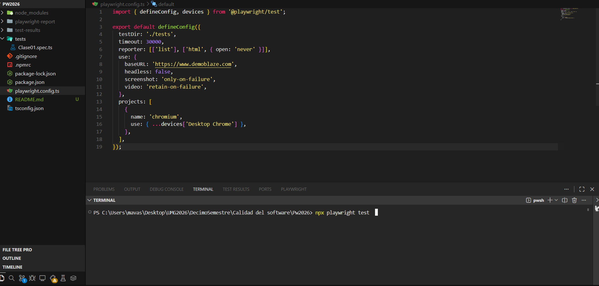
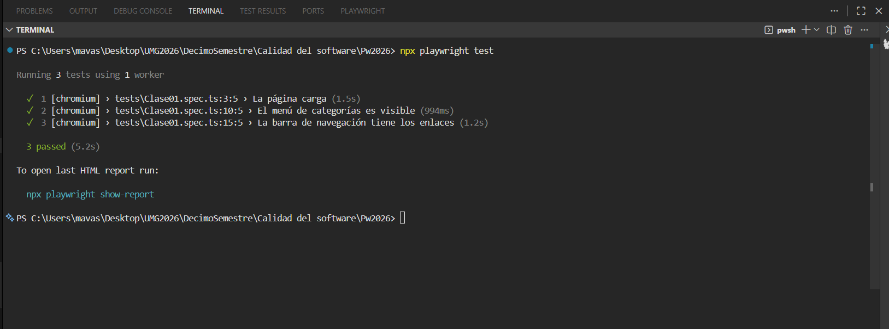
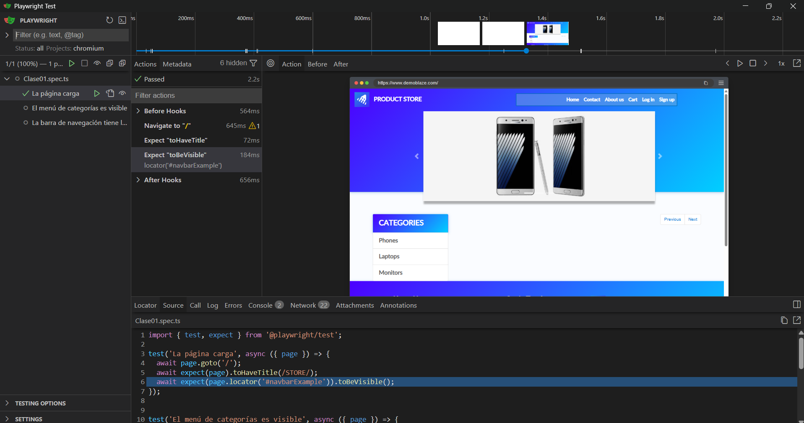
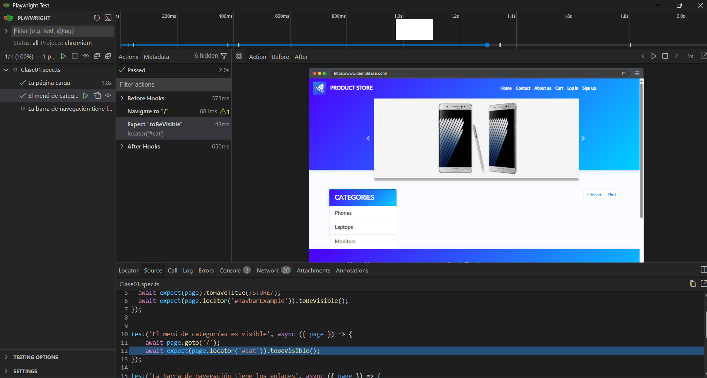
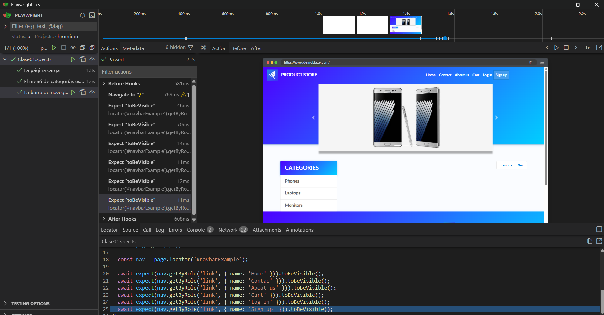
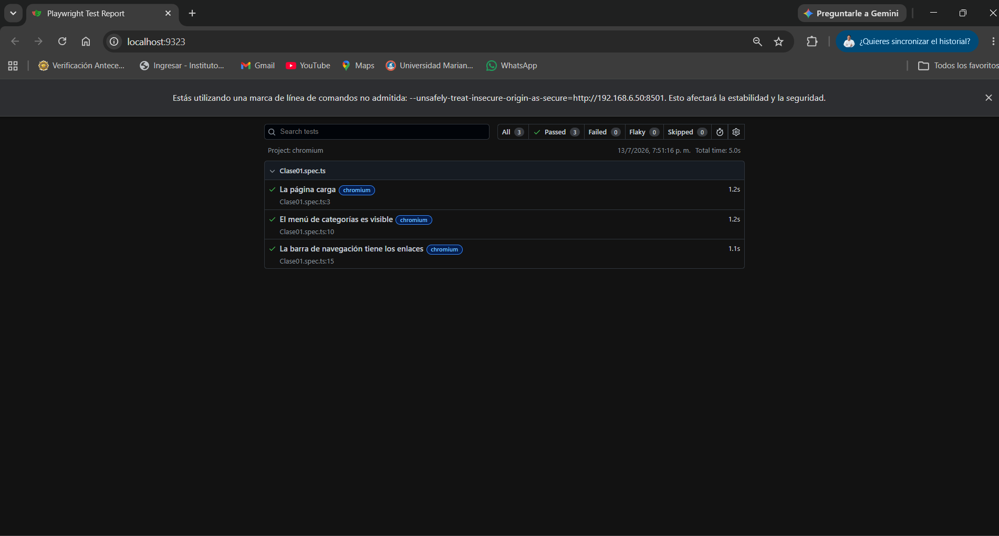

# 🧪 Proyecto de Pruebas Automatizadas con Playwright


---

## 👤 Información del Estudiante
* **Nombre:** Marvin Alexander Vásquez López
* **Carné:** 1790-22-12802
* **Curso:** Calidad del Software
* **Ciclo:** Décimo Semestre (2026)

---

## 🛠️ Requisitos
* **Node.js:** v22.22.2

---


### 1. Ejecutar las Pruebas en Consola (Modo Headless)
Ejecuta el conjunto completo de pruebas en segundo plano:
```bash
npx playwright test
```

### 2. Ejecutar las Pruebas en Interfaz Gráfica (Modo UI)
Abre la interfaz interactiva de Playwright para ejecutar y depurar los tests de forma visual:
```bash
npx playwright test --ui
```

### 3. Mostrar el Reporte de Pruebas
Visualiza el reporte detallado generado en formato HTML tras la última ejecución:
```bash
npx playwright show-report
```

---

## 📸 Evidencia de Ejecución


<details>
<summary>📂 <b>1. Ejecución en Consola (npx playwright test)</b></summary>
<br>

#### Iniciando ejecución del comando:


#### Resultado de la ejecución (Pruebas Exitosas):

</details>

<details>
<summary>📂 <b>2. Ejecución con Interfaz Gráfica (npx playwright test --ui)</b></summary>
<br>

#### Test 1: La página carga


#### Test 2: El menú de categorías es visible


#### Test 3: La barra de navegación tiene los enlaces

</details>

<details>
<summary>📂 <b>3. Reporte HTML (npx playwright show-report)</b></summary>
<br>

#### Reporte de Playwright detallado:

</details>