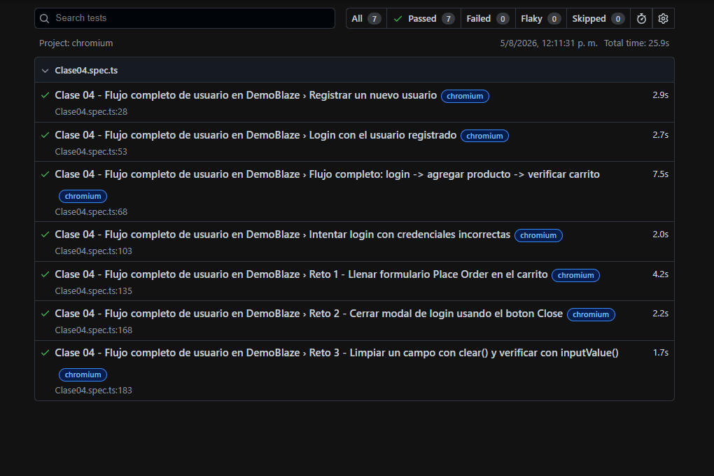

# Tarea 04 - Reflexión sobre los Principios del Testing (ISTQB)

## ¿Cuál principio es más importante y por qué?

En mi opinión, el principio más importante es el **Principio 3: Las pruebas tempranas ahorran tiempo y dinero (Shift-Left)**.

### Justificación:
1. **Impacto Económico Directo:** La regla del *Shift-Left* demuestra que identificar un defecto en las etapas de análisis o diseño de requerimientos cuesta hasta 10 veces menos que solucionarlo cuando el software ya se encuentra desplegado en producción.
2. **Eficiencia del Equipo:** Detectar y corregir incoherencias en locadores, lógica de negocio o arquitectura en las fases iniciales evita rehacer código complejo, reescribir suites de pruebas automatizadas completas o paralizar despliegues de producción.
3. **Calidad desde el Origen:** Probar desde temprano cambia el enfoque de "buscar errores al final" hacia "prevenir errores desde el inicio", garantizando una base más sólida para el desarrollo continuo del software.

### Reporte de los test

