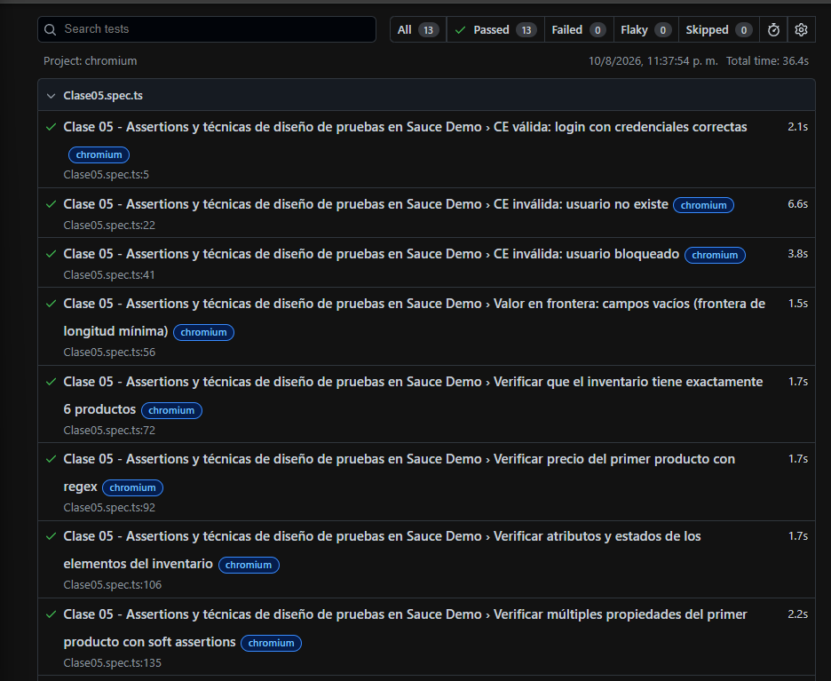
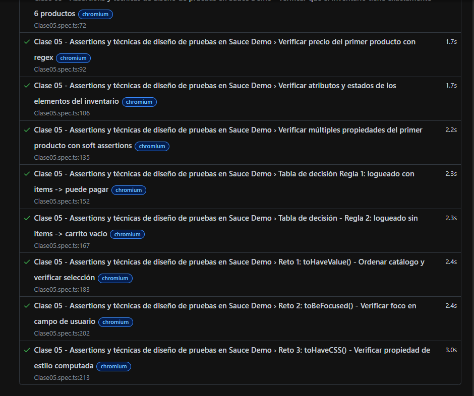

# Tabla de Decisión: Proceso de Checkout - Sauce Demo

Este documento detalla las reglas de negocio y combinaciones evaluadas para el flujo de pago (Checkout) en la aplicación Sauce Demo.

## Condiciones y Acciones

### Condiciones (Entradas):
1. **C1 (Autenticado):** El usuario ha iniciado sesión correctamente.
2. **C2 (Carrito con ítems):** El carrito de compras contiene al menos un producto agregado.
3. **C3 (Formulario Completo):** Se han llenado correctamente los campos obligatorios de información personal (Nombre, Apellido y Código Postal).
4. **C4 (Clic en Finish):** El usuario hace clic en el botón de finalizar compra en el resumen.

### Acciones (Resultados Esperados):
* **A1:** Permitir acceso al formulario de checkout (`checkout-step-one.html`).
* **A2:** Mostrar mensaje de error por falta de datos o sesión inválida.
* **A3:** Permitir avanzar al resumen de compra (`checkout-step-two.html`).
* **A4:** Completar la orden exitosamente y mostrar pantalla de confirmación (`checkout-complete.html`).

---

## Matriz de Reglas de Decisión

| Condiciones / Acciones | Regla 1 | Regla 2 | Regla 3 | Regla 4 | Regla 5 | Regla 6 |
| :--- | :---: | :---: | :---: | :---: | :---: | :---: |
| **C1: Autenticado** | Sí | Sí | Sí | Sí | No | Sí |
| **C2: Carrito con ítems** | Sí | Sí | No | Sí | Sí | Sí |
| **C3: Formulario Completo** | - | - | - | Sí | - | No |
| **C4: Clic en Finish** | - | - | - | Sí | - | - |
| **---** | | | | | | |
| **A1: Permitir acceso a checkout** | Sí | Sí | No | - | No | - |
| **A2: Mostrar mensaje de error** | No | No | Sí | No | Sí | Sí |
| **A3: Avanzar a resumen / paso 2** | - | - | - | Sí | - | No |
| **A4: Orden exitosa (Checkout Complete)**| - | - | - | Sí | - | - |

*Nota: El guion (-) indica que la condición no aplica o no es evaluada para esa regla en específico.*

## Evidencia de la tarea clase 5

