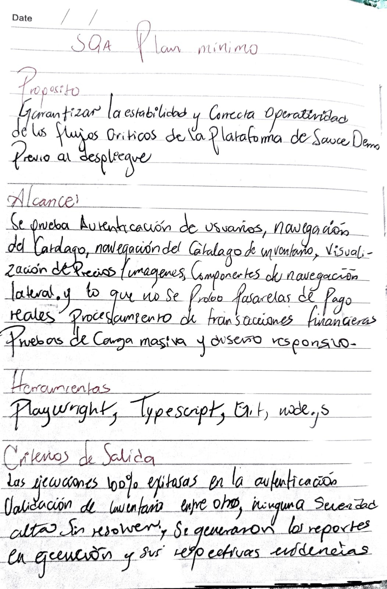
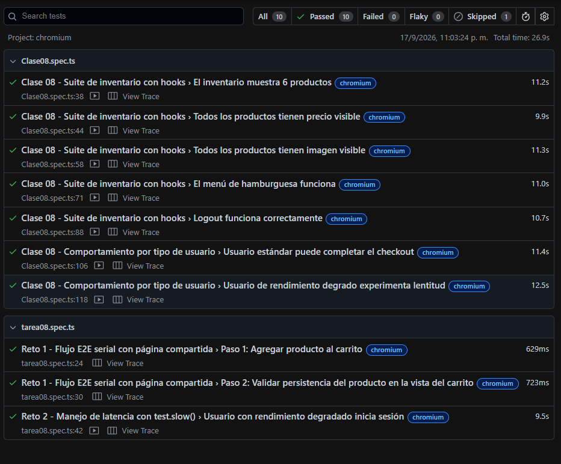
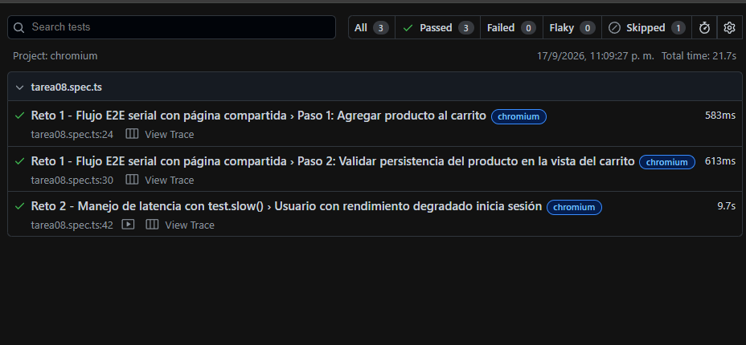

# Plan de Aseguramiento de la Calidad (SQA Plan) - Sauce Demo

## Evidencia del Plan Mínimo

## Evidencia de la clase 08 y tarea 08

## Evidencia de la clase 08 y tarea 08

> **Justificación de `--workers=1`:**  
> Se utilizó la ejecución con un único worker (`--workers=1`) para garantizar un entorno estrictamente secuencial y libre de condiciones de carrera. Esto es fundamental para suites en modo serial que comparten la instancia del navegador (`beforeAll`), permitiendo validar el flujo de pasos dependientes uno a uno y facilitando el rastreo ordenado de logs y métricas de ejecución.
